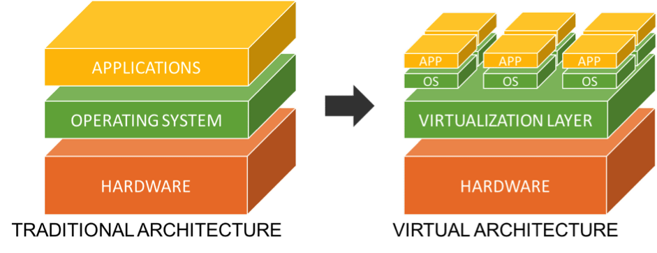
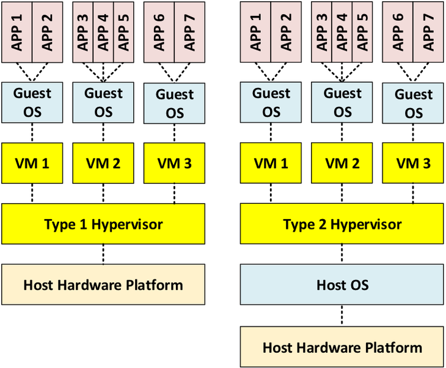
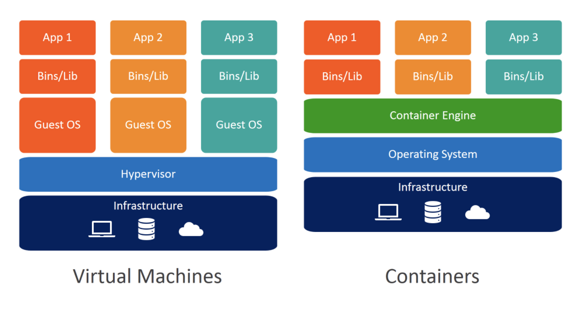
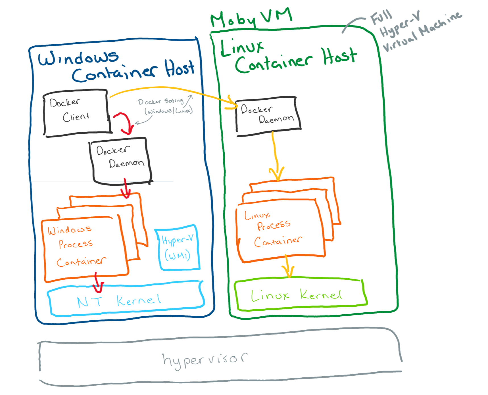

# Curso de Docker


# Virtualización: introducción


## Virtualización tradicional
- Es una abstracción de la capa de hardware
- Despliegues más sencillos
- Ahorro costes
- ...

  


## Hypervisor

- Es un monitor que orquesta el acceso de varios SO a los recursos de un servidor físico.
  


## Hypervisor type 1
- Nativo o Bare Metal Hypervisor
- Corre directamente en el hardware de la  máquina, hacen la  función de HAL (Hardware Abstraction Layer)
- Ej: VMWare ESXI, Microsoft Hyper-V, Citrix/Xen Server 


## Hypervisor type 2

- Host OS Hypervisor. 
- Corre sobre el sistema operativo, como una aplicación más.
- Ej: VMware Workstation, VMware Player, VirtualBox, Parallel Desktop (MAC), ¿KVM?
- No es adecuado cuando hay un workload elevado: Active Directory, bbdd...
- Adecuados para entornos de test
  - Más baratos
  - Instalación más sencilla 


## Contenedores

- Son una abstracción de la capa de aplicación




## Ventajas contenedores

- Más ligeros
  - Portabilidad
    - Contrato entre el sysadmin y el developer
    - Despliegues más rápidos
  - Mas eficientes -> menor coste
- Son efímeros


## Desventajas

- Menor seguridad y aislamiento
  - Depende del host  
- Snapshots
- Migraciones en caliente (VMWare vMotion)
- Son efímeros


## Qué es Docker

Herramienta **open-source** que nos permite realizar una **virtualización ligera**, con la que poder **empaquetar entornos y aplicaciones** que posteriormente podremos **desplegar** en cualquier sistema que disponga de esta tecnología


## Arquitectura docker

- Es una arquitectura cliente-servidor
  - El servidor es el daemon (docker o container engine) al que se acccede mediante una API
  - El cliente habitual es el comando **docker**
- 


-  Por defecto usa UNIX sockets:
   - Comunicacción entre procesos de la misma  máquina
   - Se maneja  por el kernel


## Contenedores Linux en windows

- El ecosistema de contenedores fundamentalmente utiliza Linux
- Como los  contenedores comparten el kernel con el host, no se  pueden ejecutar directamente en Windows, [hace falta virtualización](https://stackoverflow.com/questions/48251703/if-docker-runs-natively-on-windows-then-why-does-it-need-hyper-v )
- HyperV en Windows 10 pero versiones PRO o ENTERPRISE





#  Instalación

- Lo más usual es usar imágenes basadas en Linux
- https://docs.docker.com/engine/install/ubuntu/

## Imágenes de docker

- Se basan en una plantilla o fichero Dockerfile
- Define todas las dependencias de mi aplicación
- Cada línea del fichero Dockerfile genera una layer (capa) en la imágen
  - La caché funciona por cada línea o capa.
- Es habitual que las imágenes se creen en base a otras (herencia)


## Contenedores

- Son imágenes en ejecución
- Son **efímeros**
- La persistencia se logra mediante el uso de volúmenes
- Cada contenedor se ejecuta en un entorno aislado (podemos controlar el nivel de aislamiento):
  - variables de entorno
  - Volúmenes montados
  - Interfaces de red


## Contenedores e  imágenes
- Traemos la última versión de la imagen de redis:

```
docker pull redis
docker images
```

- Se  ve además  del  tag el size  (probar con alpine)

Lo  ejecutamos

```
docker run redis
docker  ps
```
CTRL  + D para pararlo y poodemos comprobar que  ya  no  está

Mejore en modo detached:
```
docker run -d redis
docker  stop  <container-id>
```


Si queremos arrancarlo de nuevo (no sabemos  id)
docker ps  -a
docker run redis:<version>  //hace directamente  el  pull

-  Ambos escuchan  por el mismo puerto... habrá que hacer un "binding al host!"

docker run -p5000:6379 -d redis
docker run -p5000:6379 -d redis:4.0 //error,  cambiar   puerto!!    

docker logs <name or containr-id>
los names son  aleatorios,  pero  también  los podemos dar:
docker run -p5000:6379 --name  redis-new -d redis
docker run -p5001:6379 --name  redis-old -d redis:4.0

- Otra forma  de debug es entrar a la  terminal  del  contenedor:
  - Variables de entorno
  - Estructura  ficheros
  - ....
  - pocos comandos disponibles!
```
docker exec -it <name  or container-id> /bin/bash
```

## Hello World
```
$ docker image ls
$ docker run hello-world
Hello from Docker!
```


## Creacción y acceso a un contenedor

```
docker run -it --name <container-name> -d <image-name>
docker exec -it <container-name> /bin/bash
```


## Configuración  de redes
- Internamente usa las regla de enrutado del  servidor
  - [En Linux mediante IPtables](https://docs.docker.com/network/iptables/)
- Es un sistema abierto, mediante el uso de drivers. 


##  Drivers

- **bridge**:
  - Por defecto, no es necesario especificarlo.  Los contenedores se comunican entre sí.

- **host**:
  - Usa  la red del  host directamente, elimina  el aislamiento del contenedor con el host. 
  - Comparte namespace de red con el host
  - Tiene acceso a todas las interfaces del Host
  - Evita el uso de NAT 
  - Puede provocar conflictos de puertos


- **overlay**:
  - Overlay networks connect multiple Docker daemons together and enable swarm services to communicate with each other. 
- **macvlan**:
  - Macvlan networks allow you to assign a MAC address to a container, making it appear as a physical device on your network.

- **none**:

- **Network plugins**:  

  - You can install and use third-party network plugins with Docker. These plugins are available from Docker Hub or from third-party vendors. 


# Dockerfile

## ¿Qué es un dockerfile?

- Plantilla en texto plano que define las dependencias de mi aplicación
- Las imágenes se construyen base a estas plantillas
- Cada línea del fichero Dockerfile genera una layer (capa) en la imágen
  - La caché funciona por cada línea o capa.
- Es habitual que las imágenes se creen en base a otras (herencia)


# Ejemplo servidor web con docker


## Crear dockerfile

```
# Pull the httpd image from DockerHub repository to build our application as a base
FROM httpd:2.4
# Copy the static page from the target directory to apache2 docs
COPY ./public-html/ /usr/local/apache2/htdocs/
```


## Construir imágen

```
# docker build -t my-apache2 
```


## Ejecutar contenedor

```
docker run  -p 80:80 --name my-apache2-1  my-apache2
```


## Docker-compose


## Entornos de desarrollo

- Se instalan mediante contenedores
- Aseguramos versiones:
  - Compiladores y herramientas de  builld tipo Maven, Gradle
  - BBDD
- El código fuente  se mantiene en un directorio físico asociado mediante un volumen a un  contenedor
- El código compilado se lleva a otra carpeta del host o a una nueva imagen que se utiliza para el despliegue.


Desarrollo directamente dentro del contenedor con Visual Studio Code:
https://code.visualstudio.com/docs/remote/containers  


Pipelines de CI/CD
Jenkins: https://jenkins.io/doc/book/pipeline/docker/
Azure Pipelines Container Jobs:
https://docs.microsoft.com/en-us/azure/devops/pipelines/process/container-phases?view=az ure-devops
Github actions:
● https://github.com/features/actions
● https://help.github.com/en/actions/building-actions/creating-a-docker-container-action
Tekton: CI/CD nativo para Kubernetes - https://cloud.google.com/tekton


## Limitación de recursos
- Los contenedores comparten los recursos del host
- No existe ninguna limitación en el consumo de los mismos.
- Se limitan mediante Docker Dashboard

## Seguridad
-


## Workflow con docker

- Development
- CI/CD
- Deployment

Aplicación JavaScript con MongoDB
Git commit -> CI push a private repository con mi  códdigo
Uso también  de  Docker hub para el mongoDB,  MongoExpress para no lidiar con terminal


Mongo   y  MongoExpress en la missma red:
docker network ls
docker network create mongo-network


docker run -p 27017:27017  -d --network mongo-network --name mongodb \
    -e MONGO_INITDB_ROOT_USERNAME=admin \
    -e MONGO_INITDB_ROOT_PASSWORD=password \
    mongo

// ojo  que coincida red, nombre servidor y usr/pwd!!!!!

$ docker run -it --rm \
    --network mongo-network \
    --name mongo-express \
    -p 8081:8081 \
    -e ME_CONFIG_MONGODB_SERVER=mongodb \
    -e ME_CONFIG_MONGODB_ADMINUSERNAME=admin \
    -e ME_CONFIG_MONGODB_ADMINPASSWORD=password \
    mongo-express