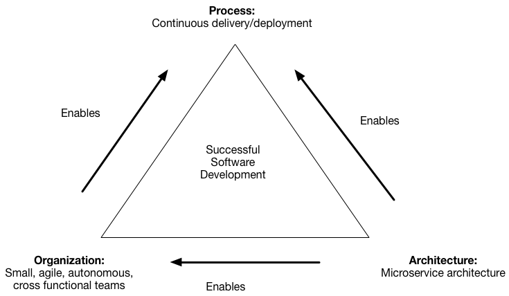
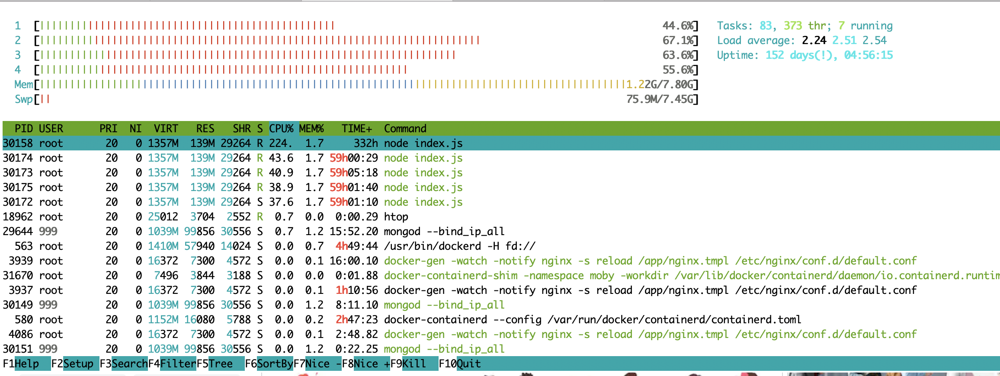
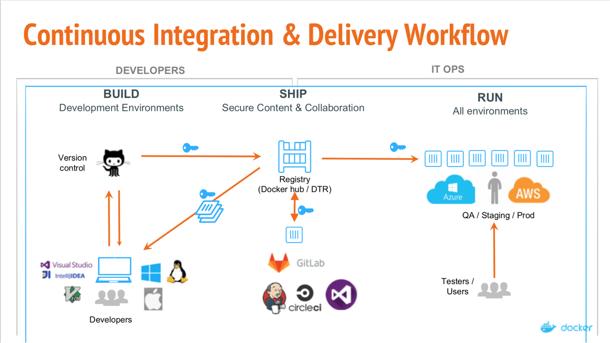

# Curso de Docker


# Virtualización: introducción


## Virtualización tradicional
- Es una abstracción de la capa de hardware
- Despliegues más sencillos
- Ahorro costes
- Aislamiento
- ...

  


## Hypervisor

- Es un monitor que orquesta el acceso de varios SO a los recursos de un servidor físico.
  


## Hypervisor type 1
- Nativo o Bare Metal Hypervisor
- Corre directamente en el hardware de la  máquina, hacen la  función de HAL (Hardware Abstraction Layer)
- Ej: VMWare ESXI, Microsoft Hyper-V, Citrix/Xen Server 


## Hypervisor type 2

- Host OS Hypervisor. 
- Corre sobre el sistema operativo, como una aplicación más.
- Ej: VMware Workstation, VMware Player, VirtualBox, Parallel Desktop (MAC), ¿KVM?
- No es adecuado cuando hay un workload elevado: Active Directory, bbdd...
- Adecuados para entornos de test
  - Más baratos
  - Instalación más sencilla 


## Contenedores

- Son una abstracción de la capa de aplicación


## Ventajas contenedores

- Más ligeros
  - Portabilidad
    - Contrato entre el sysadmin y el developer
    - Despliegues más rápidos
  - Mas eficientes -> menor coste
- Son efímeros


## Desventajas

- Menor seguridad y aislamiento
  - Depende del host  
- Snapshots
- Migraciones en caliente (VMWare vMotion)
- Son efímeros


## Como se consigue

- Usando características del kernel de Linux como:
  - Chroot y CGroups
  - Kernel namespaces
  - Apparmor
  - Union Filesystem


## chroot y cgroups

- Chroot: Un mecanismo para cambiar el directorio raíz de un proceso y sus hijos, y por tanto ejecutarlo en un entorno enjaulado (1999 - FreeBSD)
- CGroups: 
  - En el kernel de Linux desde 2008. 
  - Permiten agrupar procesos (control groups) compartiendo memoria, CPU y sistema de archivos.


## kernel namespaces
- Docker crea un conjunto de namespaces diferente para cada contenedor
  - Proporciona una capa  de aislamiento
- Se utilizan los siguientes namespaces de Linux:
  - PID namespace: procesos
  - NET namespace: interfaces de red
  - IPC namespace: recursos IPC
  - MNT namespace: puntos de montaje
  - UTS namespace (Unix Time-Sharing): hostname y domain


##  AppArmor

- Módulo de seguridad del kernel de Linux que proporciona control de acceso para confinar programas a un conjunto limitado de recursos
- Se pueden definir 2 tipos de perfiles:
  -  **enforcement**: impiden la acción y además reportan el intento
  -  **compliance**: únicamente se registra el acceso.


- Docker crea un perfil AppArmor llamado **docker-default** y lo carga en el kernel.
  - Es un perfil de protección moderada, a la vez que proporciona la máxima compatibilidad de aplicaciones. 
  - [Ver la plantilla a partir de la cual se crea la plantilla](https://github.com/moby/moby/blob/master/profiles/apparmor/template.go)


## Union Filesystem

- Se montan varias fuentes de ficheros en directorios comunes
  - Por ej  al montar un CD o un servicio NFS remoto sobre un /home
  - Es una característica disponible en muchos tipos de sistemas fde ficheros


##  Google Trends


## Cloud Native Foundation

- Nace en el 2015 con el objetivo de ayudar en el avance de las tecnologías de contenedores.
- Fundadores: Google, CoreOS, Mesosphere, Red Hat, Twitter, Huawei, Intel, Cisco, IBM, Docker, Univa, and VMware.
- [Ver mapa](https://landscape.cncf.io/)


# Docker


## Qué es Docker

Herramienta **open-source** que nos permite realizar una **virtualización ligera**, con la que poder **empaquetar entornos y aplicaciones** que posteriormente podremos **desplegar** en cualquier sistema que disponga de esta tecnología


## Arquitectura Docker

- Es una arquitectura **cliente-servidor**
  - El servidor es el daemon (container engine) al que se acccede mediante una **API REST**
  - Existen SDKs y clientes de la API para distintos lenguajes
  - El cliente habitual es el comando **docker**
- 


-  Por defecto usa **UNIX sockets**:
   - Comunicacción entre procesos de la misma  máquina
   - Se maneja  por el kernel

- Podemos configurarlo para que use **TCP**
  - Cliente y dockerd en máquinas distintas
  - Se cambia la variable de entorno ```DOCKER_HOST=tcp://X.X.X.X:2375```
  - Es recomendable  habilitar -tls (por defecto puerto 2376 para TLS) y poner un WebProxy delante para controlar el acceso.


## Objetos de Docker

- Los objetos principales en Docker son las **imágenes**, los **contenedores** y los **servicios**
- Hay otros conceptos relacionados  con ellos como **volúmenes**, **registro de imágenes** que los veremos conforme los necesitemos.


## Imagen

- Plantilla que define todas las dependencias de mi aplicación
- Es habitual que las imágenes se creen en base a otras (herencia)
- Ejemplo:

```
FROM ubuntu
MAINTAINER username (email@domain.com)
RUN apt-get update
RUN apt-get install -y nginx
CMD ["nginx", "-g", "daemon off;"]
EXPOSE 80
```


## Contenedor

- Instancia ejecutable de una imagen
- Son **efímeros**, la persistencia se logra mediante el uso de **volúmenes**
- Cada contenedor se ejecuta en un entorno aislado (podemos controlar el nivel de aislamiento):
  - variables de entorno
  - Volúmenes montados
  - Interfaces de red
- Podemos crear una imagen a  partir de  un estado del contenedor.


## Servicios
- Los servicios permiten escalar contenedores a través de múltiples demonios de Docker, los cuales trabajarán conjuntamente como un enjambre (swarm).


## Desarrollo  en Docker

- Un contenedor -> Un proceso
  - Mejor escalabilidad
  - Mejor reutilización
  - Actualizaciones


## Desarrollos actuales
  - [La carga en la comunicación de un equipo de tamaño n es  n(n-1)/2](https://en.wikipedia.org/wiki/The_Mythical_Man-Month)
  - Un  equipo de desarrollo se debe dividir en equipos  pequeños autónomos (2 pizzas)



##  Docker en Linux (I)

- En Linux Docker no es virtualizado, no hay un hipervisor. 
- Los procesos que corren dentro de un contenedor de docker se ejecutan con el mismo kernel que la máquina anfitrión.


##  Docker en Linux (II)

- Linux aisla los procesos, ya sean los propios de la máquina anfitrión o procesos de otros contenedores. 
- Controla los recursos que se le asignan a contenedores pero sin la penalización de rendimiento de los sistemas virtualizados.    


##  Docker en Windows (I)

- El ecosistema de contenedores fundamentalmente utiliza Linux
- Como los  contenedores comparten el kernel con el host, no se  pueden ejecutar directamente en Windows, [hace falta virtualización](https://stackoverflow.com/questions/48251703/if-docker-runs-natively-on-windows-then-why-does-it-need-hyper-v )
- HyperV en Windows 10 pero versiones PRO o ENTERPRISE
- HyperV y  VirtualBox no se llevan bien
- Debemos deshabilitarlo mediante el siguiente comando de PowerShell:
    ```
    Disable-WindowsOptionalFeature -Online -FeatureName Microsoft-Hyper-V-All
    ```
  - Y  además puede ser necesario  reiniciar :-(


##  Docker en Windows (II)

- Docker Client se ejecuta en Windows pero llama al Docker Daemon de una máquina virtual Linux


# Aplicación en los módulos de FP Informática


## Grado medio (I)

- Seguridad informática
  - Cortafuegos
  - Zonas desmilitarizadas
  - Copias de seguridad
  - Servicio  SSH


## Grado medio (II)

- Servicios en red  
  - Servicios de red orientados a aplicación
  - Instalación de servicios de transferencia de ficheros
  - Instalación  de servidores Web

- Aplicaciones web
  - Instalación de aplicaciones web (Wordpress, Moodle, app a medida)


## Grado superior ASIR

- Servicios de red e Internet.
- Implantación de aplicaciones web. 
- Administración de sistemas gestores de bases de datos. 
- Seguridad y alta disponibilidad. 


## Grado superior DAM

- Sistemas de gestión empresarial
- "Montar un workflow de desarrollo"


## Grado superior DAW

-  Despliegue de aplicaciones Web.
-  "Montar un workflow de desarrollo"


# Instalación


## Versiones de Docker
-  Hasta el 2019 había dos productos: 
   -  Docker Enterprise Edition
   -  Docker Community  Edition
- La versión Enterprise [la compró la empresa Mirantis](https://www.mirantis.com/software/mirantis-kubernetes-engine/) 
- Nos centraremos en la versión libre, que es la única a la que hace referencia ahora la [web de Docker](https://www.docker.com/)  


## Tipos de instalación

- Ir a la [web de Docker](https://docs.docker.com/get-docker/)
  - Se puede instalar el Docker Desktop en Windows
  - Se puede instalar el Docker Engine en Linux
- Se puede desplegar una imagen mediante Vagrant que tenga todo
- Se puede usar una OVA.


## Instalación en Linux

- Lo más usual es usar imágenes basadas en Linux
  https://docs.docker.com/engine/install/ubuntu/
- El proceso habitual de instalación es:
  - Añadir  el repositorio de  docker
  - Instalar Docker Engine
  - Configurar usuarios para uso de docker (sin  privilegios root). Ver [Linux PostInstall](https://docs.docker.com/engine/install/linux-postinstall/)
  - Instalar [Docker Compose](https://docs.docker.com/compose/install/)


## Trabajar con Docker

- Utilizaremos la terminal (cliente docker)
- Utilizaremos Visual Studio Code
  - Terminal integrada
  - Extensión Docker
  - Debug  dentro de contenedores


# Comandos básicos


## Contenedores

- Ejecutar un contenedor nuevo:
  - *docker run*
  - *docker container run*
- Iniciar un contenedor existente:
  - *docker start*
  - *docker container start*
- Parar un contenedor:
  -  *docker stop*
  -  *docker container stop*


- Borrar contenedor
  - *docker rm*	
  - *docker container rm*
- Inspeccionar contenedor
  - *docker inspect*
  - *docker container inspect*
- Ejecutar comando en un contenedor:
  - *docker exec*
  - *docker container exec*
- Ver logs:
  - *docker logs*
  - *docker container logs*


## Imágenes
- Ver listado de imágenes
  - *docker images*
- Borrar una imágen
  - *docker rmi*
- Descargar imágen:
  - *docker pull*
- Publicar  imágen:
  - *docker push* 


## Descargar imágenes

- Traemos la última versión de la imagen de redis:

```
docker pull --help
docker pull redis
```


##  Listado de imáges locales

```
docker images
```
- Aparecen datos útiles:
  -  Órigen de la imágen
  -  Versión
  -  Tamaño  que ocupa
  -  Fecha de creación


## Ejecución imágen (I)

- Recordemos que una imagen en ejecución es un contenedor

```
docker run redis
docker  ps
```
CTRL  + D para pararlo y podemos comprobar que  ya  no  está


##  Ejecución imagen (II)

- Mejor ejecutar en modo detached:
```
docker run -d redis
docker  stop  <container-id>
```


Si queremos arrancarlo de nuevo (no sabemos  id)
```
docker ps  -a
docker start <container-id>
```


## Ejercicio

- Prueba a hacer un deploy de un contenedor Apache utilizando la extensión Docker de Visual Code


## Ejecución imagen con versión

- Por defecto descargamos imágen con versión *latest*
- **docker pull redis** es equivalente a **docker pull redis:latest**
- Vamos a descargar la versión  4.0 de redis:

  ```
  docker run redis:<version>  
  # hace directamente docker pull & docker start
  ```


## redis-comander

- [Paquete de npm](https://www.npmjs.com/package/redis-commander) para acceder a Redis desde el navegador
- Instalación:
  - Debemos instalar  nodejs, la versión de la distribución de Ubuntu es antigua (v10)
  -  Instalamos usando el PPA oficial

```
sudo curl -sL https://deb.nodesource.com/setup_14.x -o nodesource_setup.sh
sudo bash nodesource_setup.sh
sudo apt-get install -y nodejs
node --version
sudo npm i -g redis-commander
redis-commander
```


## Comprobamos acceso a nuestro redis

- No nos conecta, ¿qué pasa?
  - Los contenedores funcionan por defecto en una red interna, ajenos al host
  - Veamos como funciona la configuración de red de docker


## Varios redis a la vez

- Redis funciona por una red interna
- Podríamos lanzar varios redis, y aunque escuchan  por el mismo puerto funcionaría:
  ```
    docker run  -d redis
    docker run -d redis:4.0   
  ```
- ¿A dónde conectaría ahora redis-commander?


## Configuración  de redes

- Internamente usa las regla de enrutado del  servidor
  - [En Linux mediante IPtables](https://docs.docker.com/network/iptables/)
- Es un sistema abierto, mediante el uso de drivers. 


##  Drivers - bridge

- Por defecto, no es necesario especificarlo.  Los contenedores se comunican entre sí.
-  Son las más utilizadas
-  Déjemos que docker se encargue de todo :-)
-  Ejecutar comandos:
    ```
    ip  address
    docker network ls
    docker network inspect bridge
    ```


 


## ¿Cómo  se accede  al exterior?
  ```
  $ sudo iptables -t nat -L –n
  ...
  Chain POSTROUTING (policy ACCEPT) target prot opt
  source destination MASQUERADE all -- 172.17.0.0/16
  !172.17.0.0/16
  ...
  ```


##  Drivers - host

  - Usa  la red del  host directamente, elimina  el aislamiento del contenedor con el host. 
  - Comparte namespace de red con el host
  - Tiene acceso a todas las interfaces del Host
  - Evita el uso de NAT 
  - Puede provocar conflictos de puertos


##  Drivers - overlay

- Para conectar múltiples demonios docker y permitir la comunición entre servicios swarm.


##  Drivers - macvlan

- Permite asignar direcciones MAC a los contenedores, haciendo que aparezcan como dispositivos físicos en la red.


##  Drivers - otros

- **none**:

- **Network plugins**:  

  - Se pueden instalar y  usar  plugins  de  red  de terceros. 


## Debug de un contenedor

- La forma más evidente es entrar a la  terminal  del  contenedor:
  - Variables de entorno
  - Estructura  ficheros
  - pocos comandos disponibles!

```
docker exec -it <name  or container-id> /bin/bash
```


## Ejercicio

- Comprueba que efectivamente los contenedores se pueden comunicar entre sí.


## Ejercicio - solución

- Accede al fichero /etc/host de cada contenedor para ver su ip 
- Haz un ping entre contenedores
  ```
  docker exec -it <container-name> /bin/bash
  apt update
  apt install iputils-ping
  # para ver la ip también podíamos haber utilizado el comando ip
  # apt install iproute2
  # ip address
  ping <ip-container>
  ```


## ¿Cómo dar acceso a  redis-commander?

- En modo bridge, podemos mapear puertos del contenedor al host:

  ```
  docker run -p5000:6379 -d redis
  # error siguiente línea,  cambiar   puerto!! 
  docker run -p5000:6379 -d redis:4.0  
  ```

- Otra opción es arrancar el contenedor en modo  host:
  ```
  docker run  --network host -d redis
  # ¿Qué sucede si lo  arrancas dos veces?
  docker run  --network host -d redis
  ```


  
## Logs de un contenedor

```
docker logs <name or container-id>
```

- Los contenedores tienen  un nombre aleatorio, pero se puede dar de forma explícita:
```
docker run -p5000:6379 --name  redis-new -d redis
docker run -p5001:6379 --name  redis-old -d redis:4.0
```


## Ejercicio

- Comprueba el estado  de imágenes y contenedores de tu equipo
- Elimina todas las imágenes
- Elimina todos los contenedores (también los parados)


## Solución

- Estado actual:
  ```
  docker ps
  docker ps -a
  docker  images
  ```

- Borrar imágenes:
  ``` 
  docker rmi $(docker images -a -q)
  ```

- Borrar  contenedores:
  ```
  docker rm $(docker ps -a -q)
  ```


## Ejercicio

- Descarga **redis:latest** y comprueba su versión
- Descarga esa versión específica (redis:x.y.z)
- Comprueba que tienes dos imágenes al hacer un listado pero que:
  - Ambas ocupan el mismo tamaño
  - Son idénticas:
    - Mismo **IMAGE ID**
    - No se ha producido ninguna descarga de layers adicionales.


## Solución

- Ejecutar  contenedor latest y  ver versión
  ```
  docker run --name redis-new -d redis
  docker inspect redis-new|grep -i version
  docker exec -it redis-new env
  ```

- Descargar versión actual y comprobar que ambas son idénticas
  ```
  docker pull redis:6.2.5 # en mi caso
  docker images
  ```


## Versiones imágenes

- No es aconsejable utilizar imágenes con etiqueta latest
  - Se pueden producir breaking changes
  - No está claro el versionado de la imágen.


# Docker Hub


## Registros de imágenes

- Podemos crear una imagen de cero pero lo normal es usar o partir de una ya creada.
- Hay un registro oficial de imágenes proporcionado por Docker:  [Docker Hub](https://hub.docker.com)
- También podemos crear nuestro propio servicio.


## ¿Qué es Docker hub?

- Un **repositorio de imágenes**: descarga y publicación.
  - Repositorio de **imágenes oficiales  de Docker**, de alta calidad.
  - Repositorio de **imágenes verificadas publicadas por terceros**.


## ¿Que más  ofrece?

- **Gestor  de  equipos y organizaciones**: acceso a repositorios privados.
- **Autobuilds**: crea nuevas versiones de imágenes en base a cambios en repos de Github/Bitbucket
- **Webhooks**: Ejecuta acciones después para integrar DockerHub con otros servicios


## Limitaciones descargas

- Desde final del 2020 Docker impuso limitaciones en el uso de su registro.
  - 100 descargas de imágenes cada 6 horas para usuarios anónimos (por IP)
  - 200 descargas de imágenes cada 6 horas para usuarios autenticados
  - [Cuentas **pro**   y **team**](https://www.docker.com/pricing) para aumentar los límites.
  - [Cómo saber mi rate limit actual](https://docs.docker.com/docker-hub/download-rate-limit/)
- Conclusión: ¡¡¡Debemos hacer ***docker login***!!!


## Autenticación

- Crear cuenta en [Docker Hub](https://hub.docker.com/)
- Hacer login desde consola
  ```
  docker login
  ````
- Se crea un fichero de configuración en *$HOME/.docker/config.json*
- Las siguientes veces que nos autentiquemos, al hacer *docker login* leerá directamente el fichero
- Observa que si cerramos  la sesión la entrada *auths* del fichero *config.json* queda vacía


## Workflows
- Si queremos un repositorio compartido entre varios usuarios necesitamos crear una organización
- Desde Junio 2021 los [autobuilds](https://docs.docker.com/docker-hub/builds/) son de pago
  - Si usamos GitHub podemos usar **GitHub Actions**


## Nuestro propio registro

- Docker viene configurado por defecto para buscar las imágenes de Docker Hub
- Es posible usar nuestro propio registro:
  - Podemos usar la misma **implementación vanilla del Docker registry** que usa Docker Hub
  - Otros más avanzados como Harbor (Open Source, era VMWare), Artifactory (JFrog), Nexus (Sonatype), etc.


## Otros registros

- Docker también ofrece una versión enterprise de su registro llamada Docker Trusted Registry (DTR)
- Google Container Registry (GCR), Amazon Elastic Container Registry (ECR), Azure Container Registry (ACR), Quay (Redhat, versión On-Prem y versión cloud), Gitlab Container Registry, Github Packages, etc.


## Repositorios
- Pueden ser públicos o privados (1 gratis)
- Se crean desde Docker Hub
- Cada repo  puede tener una o varias imágenes, en función de la tag
- Las imágenes se publican mediante el comando
  ```
  docker push <hub-user>/<repo-name>:<tag>
  ```
- Se  pueden consultar  mediante  ``` docker search <keyword>```
  - Lo más  habitual es hacerlo vía web, no con consola


# Prácticas DockerHub


## Práctica 1

- **redis y redis-commander dockerizados**
  - Evitamos problemas de dependencias
  - las máquinas host se quedan "limpias"


## redis-comander

- [Paquete de npm](https://www.npmjs.com/package/redis-commander) para acceder a Redis desde el navegador
- Instalación:
  - Debemos instalar  nodejs, la versión de la distribución de Ubuntu es antigua (v10)
  -  Instalamos usando el PPA oficial

```
sudo curl -sL https://deb.nodesource.com/setup_14.x -o nodesource_setup.sh
sudo bash nodesource_setup.sh
sudo apt-get install -y nodejs
node --version
sudo npm i -g redis-commander
redis-commander
```


## Comunicación entre contenedores

- Queremos que se comuniquen entre sí utilizando **redes bridge**:
  - **default**: las que utilizabamos hasta  ahora
  - **user defined**: 
    - Interacionan solo los contenedores definidos en esta red
    - Hay resolución de nombres


## User defined vs default bridge


## Buscar imagen  en Docker Hub
- Opciones
  - Construir nuestra propia imagen (todavía no sabemos)
  - Utilizar una imagen ya preparada  en Docker Hub:
    - Menos propenso  a errores
    - Más rápido
  - Modificar una imagen ya preparada:
    - ¿Dockerfile? ¿FROM?


## User defined network

- Creación de red:

```
# docker network rm my-net
docker network create my-net
```

- Uso de red:

```
docker create --name my-nginx \
  --network my-net \
  --publish 8080:80 \
  nginx:latest
```


## Solución

```
docker network create redis-net
docker run --rm --name redis --network redis-net -d redis
docker run --rm --name redis-commander --network redis-net  -d \
  --env REDIS_HOSTS=redis \
  -p 8081:8081 \
  rediscommander/redis-commander:latest
```

- Comprueba que efectivamente funciona (*docker log*)
- Entra a uno de los dos contenedores y comprueba el ping por *name*


## Práctica 2

- Monta un escenario como  el anterior con MySQL o MariaDB y phpMyAdmin


## Práctica  3

- Comprueba las versiones de imágenes de httpd
  - ¿Vía web?
  - ¿Vía docker  search?


## Práctica 3 - opciones
- *docker search* no nos sirve
- *Vía web* aunque es algo "laborioso"
- Prueba y error con la versión que queremos
- Usando [hub tool](https://www.docker.com/blog/docker-hub-experimental-cli-tool/)
```
  hub-tool tag ls <repo-name>
```


## Práctica 4

- Ejecuta una imagen 2.2 de Apache en DockerHub y modifica el index.html para que aparezca HolaMundo
  - ¿Cómo has modificado el index.html?


## Práctica 4 -  opciones

- Instalando en el contenedor  un editor y entrando mediante:
```
docker exec -it <container> bash
```
- Mediante el [comando cp de Docker](https://docs.docker.com/engine/reference/commandline/cp/)
- Mediante  el plugin Docker de Visual Studio Code (lo más sencillo)


## Práctica 5

- Imagina que hay un  bug importante en Apache que está arreglado en la versión 2.4
- Actualiza la versión  de  nuestra aplicación  HolaMundo anterior a Apache2.4


## Práctica 5 -  opciones

- Las dos opciones  más adecuadas serían:
  - Generar una nueva imagen de nuestra aplicación
    - No sabemos hacerlo todavía
    - Realmente tampoco lo habíamos hecho, utilizabamos directamente la imagen de Apache
  - Buscar persistencia de algún modo en nuestro contenedor efímero.
    - Usámos volúmenes o bind-mounts


## Volúmenes

- Docker gestiona el volumen de forma transparente
```
  docker-volume ls
  docker volume  rm <volume-id>
  docker volume inspect <volume-id>
```

- Ejemplo  con nginx:
```
  docker run -d --name=nginx -v nginx-vol:/usr/share/nginx/html nginx:latest
```


## Bind mounts

- El volumen se mapea a un directorio físico acccesible no solo por Docker.
- Si el directorio no existe, se crea.

```
docker run -d --name=nginx -v ./nginx-web:/usr/share/nginx/html nginx:latest
```


# Construcción imágenes en Docker (1)


## Objetivos

- Aprender a crear ficheros Dockerfile
- Aprender  a crear y publicar imágenes
- Entender el concepto de layers en imágenes.


## ¿Qué es un dockerfile?

- Plantilla en texto plano que define las dependencias de mi aplicación y la imagen.
- Cada línea del fichero Dockerfile contiene una serie de comandos que generan una capa en la imágen
  - Se ejecutan de manera secuencial
  - Existe una caché que funciona por cada línea o capa.
- Es habitual que las imágenes se creen en base a otras (herencia)


## Concepto de capas

- Una  imágen es un conjunto  de capas de solo lectura, generadas por el Dockerfile
- ¿Qué es un contenedor?
  - Una  imagen en ejecución
  - Una imágen con una capa de lectura/escritura encima del resto de capas llamada  **container layer**
- Cualquier cambio que hagamos en un contenedor, se  lleva a cabo  en la **container layer**


## Ejemplo

- Vamos a crear una imagen que visualice el contenido de un fichero al ejecutar el contenedor
- Crea un directorio y coloca un fichero *holaMundo.txt* con el texto  *¡Hola Mundo!*
- Crea un fichero *Dockerfile* en el mismo directorio con el siguiente contenido:

```
FROM ubuntu:latest
RUN mkdir -p /app
COPY holaMundo.txt /app/holaMundo.txt
RUN chmod 600 /app/holaMundo.txt
CMD cat /app/holaMundo.txt
```


- Creamos la imagen y etiquetamos:
```
  docker build -t <dockerHubUserName>/holaMundo .
  docker tag  <dockerHubUserName>/holaMundo:1
  docker tag  <dockerHubUserName>/holaMundo:1.0
  docker tag  <dockerHubUserName>/holaMundo:1.0.0
  docker image ls
  ```
- Ejecutamos la imagen:
  ```
  docker run <dockerHubUserName>/holaMundo
  ```
- Subimos la imagen con todas sus tags
  ``` 
  docker push -a <dockerHubUserName>/holaMundo
  ```


## Análisis Dockerfile

- FROM nos sirve para partir de una imagen previa
- RUN: ejecuta comandos 
- COPY: copia ficheros de nuestro contexto a la imagen
- CMD: Ejecuta un comando al iniciar el contenedor
- Más info en las [referencias de Dockerfile](https://docs.docker.com/engine/reference/builder/)


## Explorar capas

- Podemos  ver las capas también mediante *docker inspect* y *docker history*
  - No todos los pasos generan una nueva capa, algunos comandos solo alteran configuración (CMD, ENV, ENTRYPOINT, EXPOSE, etc.).

- La herramienta Dive nos sirve para explorar con más detalle las capas de las imágenes de Docker
https://github.com/wagoodman/dive


## Cache

- Las líneas del Dockerfile en principio se cachean
- Si se produce un MISS ya no se usa más caché en esa compilación
  - Escribir las líneas más "frecuentes primero"
  - Si hay líneas "con dependencias", ej apt-get update y apt-install juntas.

- Si no queremos caché (ni para *FROM image*):
```
docker build --no-cache --pull -t myApp .
```


# PRACTICAS IMÁGENES


## PRACTICA 1

- Crea una imagen que se base en Ubuntu y que permita:
  - Editar ficheros con vim
  - Ejecutar el comando ping


## Solución

- Observa el *-y* para  evitar la parte interactiva del comando *apt-get install*

```
FROM ubuntu:latest
RUN apt-get update
RUN apt-get install -y vim iputils-ping
```


- Comprueba con dive los recursos  utilizados

```
docker build -t test .
dive test
```


## Mejor solución

```
FROM ubuntu:latest
RUN apt-get update && apt-get install -y --no-install-recommends \
  vim \
  iputils-ping \
  && rm -r /var/lib/apt/lists/*;
```


## ¿Qué falla aquí?

```
FROM ubuntu:latest
RUN apt-get update && apt-get install -y --no-install-recommends \
  vim \
  iputils-ping
RUN rm -r /var/lib/apt/lists/*; \
```


## PRÁCTICA 2
- Crea una imagen a partir de las instrucciones del ejercicio anterior (vim + ping) pero con el comando [docker commit](https://docs.docker.com/engine/reference/commandline/commit/)
- Verifica la imagen (capas y tamaño)


## PRÁCTICA 3

- Vamos  a crear una  versión v2.0 de nuestro holaMundo, que en vez de coger el fichero de local lo coja de una URL mediante el comando [ADD](https://docs.docker.com/develop/develop-images/dockerfile_best-practices/#add-or-copy)
- Compila la imagen y ejecútala
- Cambiaremos los datos del fichero apuntado por la URL
- Compila de nuevo la imagen y ejecuta otra vez
- ¿Qué pasa? ¿Comó lo solucionas?


# Construcción imágenes en Docker (2)


## Almacenamiento

- En docker, las imágenes se construyen a base de capas
- Cada capa contiene únicamente las diferencias respecto a la capa padre. 
- Docker utiliza mecanismos de union filesystems para montar en una carpeta la combinación de las distintas capas.


## Almacenamiento

- Al crear un contenedor, Docker añade una capa adicional (la capa de contenedor), que es la única sobre la que es posible escribir.
- El contenedor modifica aparentemente la imagen base, como si tuviera una copia real, pero únicamente está modificando esta última capa. 
- Podemos crear múltiples contenedores sobre una misma imagen, reutilizando todas las capas excepto la capa de contenedor.
- Al destruir un contenedor, esta capa con las modificaciones se destruye.


## Tamaño de las imágenes

-  Borrar un archivo en un paso del Dockerfile no elimina ese archivo de las capas anteriores de la imagen. 
   - El archivo sigue presente, pero no es accesible desde el contenedor.
   - Es la forma de comportarse de los union filesystems

   ```
    FROM ubuntu
    RUN apt-get install alguna-herramienta
    RUN algo-que-utiliza-la-herramienta para compilar o hacer algo
    RUN apt-get remove alguna-herramienta
    ```


## Build Context

- Al hacer un build se envían al daemon docker los ficheros de la ruta especificada como contexto: 

``` 
# En este caso el contexto es ".", el directorio actual:
$ docker build -t myimage -f Dockerfile .
```
- Es recomendable usar una carpeta separada para almacenar el contexto.
- Podemos crear un fichero *.dockerignore*

```
# contexto vacío, si no necesitamos añadir ficheros al contenedor, mediante "-"
docker build -t myimage -f Dockerfile -
```


## Tipos de imágenes
  - **Used**: Las que aparecen al hacer un  *docker ps  -a*
  - **Unused**: Las que no aparecen (se usaron en su momento pero se ha borrado el contenedor)
  - **Dangling images**:  Imágenes  que se crean sin  nombre, y se muestran como  **\<none\>**.
    - Útil  cuando  estamos haciendo pruebas de compilación


## Gestión de espacio

- Conforme vamos usando  docker, descargando imágenes... empezamos a ocupar  espacio
- Comprobar el espacio usado: 
```
docker system df 
```
- Eliminación de imágenes:
  
```
  docker system prune  -a #  unused  y  dangling images
  docker system prune # dangling images
```


## Multistage builds

- Se crea la  primera  imagen que sirve para obtener lo que se usa en  el segundo stage  (ver --from=n)
- Todo lo que no se usa  queda  fuera del  último stage que es el definitivo
  - Útil  para entorno de compilación
  - Se reduce el tamaño final de la imagen al quedarnos solo con el ejecutable


## Ejemplo multistage

```
# syntax=docker/dockerfile:1
FROM golang:1.16
WORKDIR /go/src/github.com/alexellis/href-counter/
RUN go get -d -v golang.org/x/net/html  
COPY app.go ./
RUN CGO_ENABLED=0 GOOS=linux go build -a -installsuffix cgo -o app .

FROM alpine:latest  
RUN apk --no-cache add ca-certificates
WORKDIR /root/
COPY --from=0 /go/src/github.com/alexellis/href-counter/app ./
CMD ["./app"]  
```


# Docker Compose


## Qué es Docker Compose

- Herramienta para definir  y ejecutar aplicaciones con varios contenedores Docker.
- Se definen los contenedores (servicios) de la aplicación mediante un fichero  YAML.
- Se levantan mediante el comando ```docker-compose up```


## Prueba de uso

- [Referencia de uso](https://docs.docker.com/compose/compose-file/compose-file-v3/)
- Vamos a analizar un caso sencillo con 3 contenedores:
  - web server con  php
  - db con MySQL
  - phpMyAdmin
- Clona [este repositorio](https://github.com/juanda99/practica-docker-compose-php/blob/main/docker-compose.yml)


## Docker-compose con Image
- Óptimo para producción, más rápido que un build y todo *empaquetado*
- Crea una imagen de Apache con un HolaMundo
- Ejecútala mediante docker-compose.yml


## Proxy  inverso
-  Para dar un  servicio externo, en web el  puerto es el 80
-  ¿Cómo hacemos para que los servicios anteriores funcionen todos en el 80?
    - Proxy inverso en función de la url
    - Similar a un virtual host  de apache pero que se configura solo en función de las peticiones que le llegan al docker daemon
    - Usaremos [https://github.com/nginx-proxy/nginx-proxy] nginx-proxy o  [https://github.com/traefik/traefik]traefik


## Shell  script para espera de bbdd
 

## Práctica ODOO

-  Seleccionar en DockerHub una imagen de Odoo
-  Desplegar la imagen con  la  bbdd adecuada como servicios (usando  *docker-compose.yml*)


  ## Práctica Dolibarr

-  Seleccionar en DockerHub una imagen de Dolilbarr 
-  Desplegar la imagen con  la  bbdd adecuada como servicios (usando  *docker-compose.yml*)


##  Práctica Wordpress
  - En la web de Docker hay [ejemplos de Wordpress, Django o Rails](https://docs.docker.com/samples/wordpress/)
  - [Repo con wp-cli, copias de seguridad o caché](https://github.com/juanda99/wordpress-docker)


## Mooodle


## Práctica crontab


## Práctica copias de seguridad


# Monitorización


##  Visión  general





## Datos en docker

- Ver  uso  contenedores
```
docker stats --no-stream
```

- Procesos en ejecución
  
  ```
  docker  top <container_id>
  ```

- Consultas al demonio de docker
- Consultas específicas por contenedor
```
docker exec -it <container-id> top
```
- Configuraciones intrínsecas a los servicios (por ej. mod_status en Apache)


## Gestión de la  memoria

- El kernel si no tiene suficiente memoria arroja  un  **OOME (Out of memory exception)**.
  - Empieza a matar procesos para liberar memoria
  - Puede tirar todo el sistema si mata el proceso equivocado (por ej. el demonio de Docker)
- Docker ajusta la prioridad de OOM del demonio para reducir la probabilidad de recibir un kill.


## Gestion de memoria de los contenedores

- La prioridad de los contenedores no se debe ajustar.
  - El host debe tener suficiente memoria
  - Para evitar errores se  debe **limitar el uso de memoria de los contenedores**


## Ejemplo configuración

- La configuración cambia bastante entre versiones de docker-compose

```
services:
  service:
    image: nginx
    deploy:
        resources:
            limits:
              cpus: 0.50
              memory: 512M
            reservations:
              cpus: 0.25
              memory: 128M
```


# Workflow con docker


## Desarrollo con  Vagrant

- Buena opción si trabajamos en equipos Windows y no queremos preocuparnos de despliegues
- Descargamos Vagrant
- Configuramos Vagrant (ver después) o hacemos un git clone de https://github.com/juanda99/vagrant-deploy-virtualbox-docker


  
## Configuración Vagrant-Virtual Box

- Nos situamos en  un  directorio e inicializamos mediante ```vagrant init```
- Modificamos el fichero  Vagrantfile creado con algo como:
  ```
  # Every Vagrant development environment requires a box. You can search for
  # boxes at https://vagrantcloud.com/search.
  #config.vm.box = "base"
  config.vm.box = "bento/ubuntu-20.04"
  config.vm.network :forwarded_port, host: 8000, guest: 8000
  # require plugin https://github.com/leighmcculloch/vagrant-docker-compose
  config.vagrant.plugins = "vagrant-docker-compose"
  # install docker and docker-compose
  config.vm.provision :docker
  config.vm.provision :docker_compose, yml: "/vagrant/docker-compose.yml", rebuild: true, run: "always"
  ```
- Añadimos servicios  mediante docker-compose cuyo punto de entrada se mapee al host en el 8000


## Workflow en local


## Workflow global



- Development
- CI/CD
- Deployment